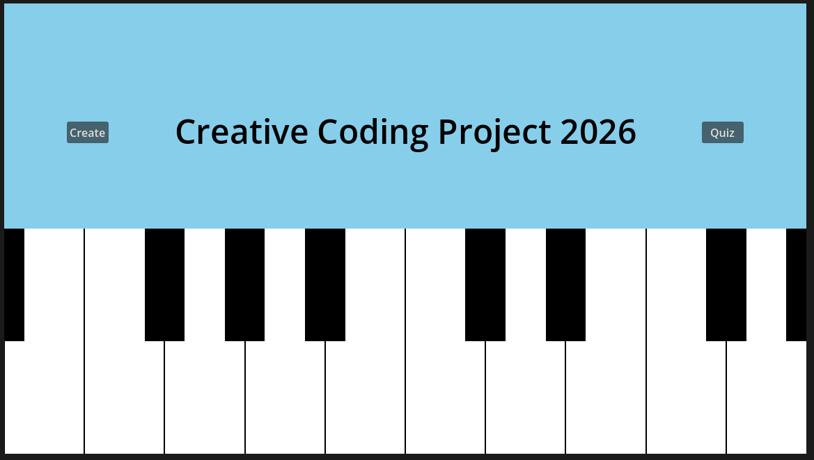
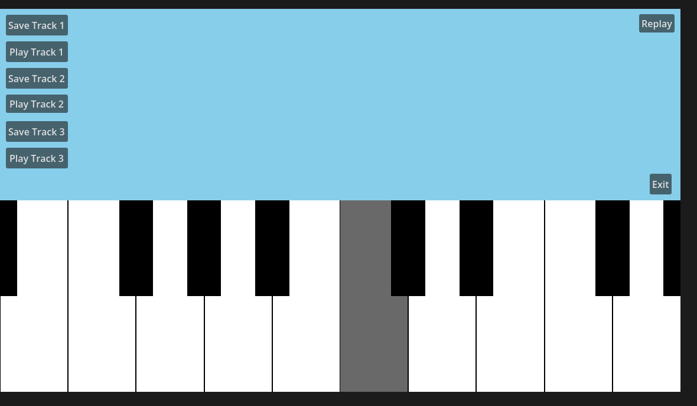
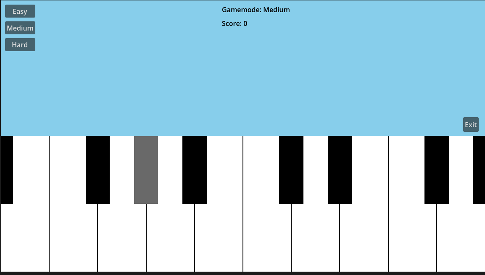

# cc26_project

Name: Adam Bermingham

Student Number: A00032216

Class Group: TU850/A

# Screenshots

# Project Description

This project is a creating a digital piano, where you can create music and also test your music knowledge and memory!
In the creating music scene you can play the piano as much as you want, listen back to it and even save it!
Then on the quizzing page you select from 1 of 3 difficulties, even co-responding to a different length of notes, you listen to it
and then try play it back with points given out for every correct note or how far off you were!

# Instructions for use

The middle row of the keyboard represents the white keys on a keyboard, with H being middle. The black keys then are in the top
row of a keyboard, in between the white keys of the row below (example C# is U, D# is I)

# How it works

The piano is drawn using rectangles and I take inputs from the keyboard depending on what key is pressed. When you press a key
the note gets added to an array to be stored and saved. I then have a function that lists the key as 'active' which displays
the shaded option on the visual screen. If the replay button is pressed, the program runs back through the array. Then when 
saving the list, the array gets copied to another clear and the array gets cleared, this allows a new replay array to created / use.

The quiz page works very similarly, but the program first randomly generates a series of notes (length based on the length). This gets
played to the user, before they try to recreate the array. The user plays a key similar to the creating music scene, execept now it is
compared with the co-responding key in the array. If it is a match 1 point is added, off by 1, 0.5 is added and off by 2, 0.25.
The drawing also changed slightly to display the correct answer to users, 0 represents a standard key, 1 is an active key, inputted by
the user and 2 is the correct key in the array sequence.

# What I am proud of in the assignment

I'm proud that I was able to make the quiz work correctly, when starting this project I knew it would be possible but doubted whether
or not I myself could do it. But with a lot of refractoring, making slight adjustions and just simply having patience I managed to get 
it working, which I am very proud of.

# What I learned

I learn more niche techniques in Godot, such as how to change scenes inside the game which was really interesting. I also learned
about how important it is to keep my code structured, as when it came to me having to refractor it, I really struggled making changes
to the unstructured sections.
